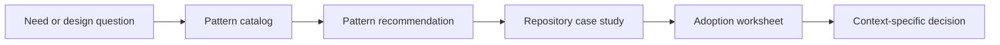

# Repository Patterns

Repository Patterns is a small, recommendation-oriented library for designing and improving software repositories, agent harnesses, and developer workflows.

It answers questions such as:

- Where should a boundary live?
- When should a core become an adapter or an extension?
- How can a workflow survive retries and restarts?
- What evidence should a repository collect before calling a change complete?

The examples are deliberately concrete. The first case study is [Pi Agent Harness](https://github.com/earendil-works/pi), because Pi makes package boundaries, extension points, durable execution, and consumer-level verification unusually visible.

This is not a rulebook. A pattern is a useful option when its context, benefits, and costs match the problem. Each page should make that judgment easier.

## Fast path for an LLM

An agent enters at [[AGENTS]]. It explains how to resolve wiki links such as `[[catalog]]`: each one names the only file with that name in the repository. Every document is reachable from there.

1. Read [[index]] for the current map.
2. Select a need in [[catalog]]. The catalog groups 36 patterns under five questions: structure, extensibility, core runtime design, verification, and repository operations.
3. Read the matching pattern page.
4. Read the relevant [[pi-case-study|Pi case study]], or another example as the library grows. [[pi-essence|What makes Pi work]] connects the patterns to eight design principles.
5. Use the [[adoption-worksheet|adoption worksheet]] to compare the pattern with the target repository.

Ask the LLM to return: the observed target state, the candidate pattern, fit, trade-offs, the smallest adoption step, and what remains unverified.

## Architecture of this repository

The repository separates reusable ideas from evidence and from decisions made in a particular project.

## Start here

| Document | Question it answers |
|---|---|
| [[catalog]] | Which pattern might help? |
| [[library-architecture]] | How is this meta repository organized? |
| [[pattern-index]] | What does each pattern mean? |
| [[pi-case-study]] | How do the ideas appear in a real repository? |
| [[pi-essence]] | Which design principles make Pi work, and where does it drift? |
| [[pi-repository-layout]] | How does Pi arrange folders, packages, and documents? |
| [[using-this-repo]] | How should a human or LLM use the material? |
| [[pattern-template]], [[case-study-template]], [[adoption-worksheet]] | How can a new pattern or case study be added, or a pattern adopted? |
| [[0001-recommendations-not-rules]] | Why is this a recommendation library rather than a rulebook? |

## Scope boundary

This repository is about reusable repository and agent-system design patterns. It is not a replacement for project-specific architecture, security review, product decisions, or live acceptance evidence.
