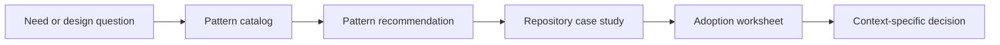

# Repository Patterns

Repository Patterns is a small, recommendation-oriented library for designing and improving software repositories, agent harnesses, and developer workflows.

It answers questions such as:

- Where should a boundary live?
- When should a core become an adapter or an extension?
- How can a workflow survive retries and restarts?
- What evidence should a repository collect before calling a change complete?

The examples are deliberately concrete. The first case study is [Pi Agent Harness](https://github.com/earendil-works/pi), because Pi makes package boundaries, extension points, durable execution, and consumer-level verification unusually visible.

This is not a rulebook. A pattern is a useful option when its context, benefits, and costs match the problem. Each page should make that judgment easier.

## Fast path for an LLM

1. Read [`index.md`](index.md) for the current map.
2. Select a need in [`docs/catalog.md`](docs/catalog.md).
3. Read the matching pattern page.
4. Read the relevant [Pi case study](docs/examples/pi/README.md), or another example as the library grows.
5. Use the [adoption worksheet](docs/templates/adoption-worksheet.md) to compare the pattern with the target repository.

Ask the LLM to return: the observed target state, the candidate pattern, fit, trade-offs, the smallest adoption step, and what remains unverified.

## Architecture of this repository

The repository separates reusable ideas from evidence and from decisions made in a particular project.

## Start here

| Document | Question it answers |
|---|---|
| [`docs/catalog.md`](docs/catalog.md) | Which pattern might help? |
| [`docs/architecture.md`](docs/architecture.md) | How is this meta repository organized? |
| [`docs/patterns/README.md`](docs/patterns/README.md) | What does each pattern mean? |
| [`docs/examples/pi/README.md`](docs/examples/pi/README.md) | How do the ideas appear in a real repository? |
| [`docs/using-this-repo.md`](docs/using-this-repo.md) | How should a human or LLM use the material? |
| [`docs/templates/`](docs/templates/) | How can a new pattern or case study be added? |
| [`docs/decisions/0001-recommendations-not-rules.md`](docs/decisions/0001-recommendations-not-rules.md) | Why is this a recommendation library rather than a rulebook? |

## Scope boundary

This repository is about reusable repository and agent-system design patterns. It is not a replacement for project-specific architecture, security review, product decisions, or live acceptance evidence.
