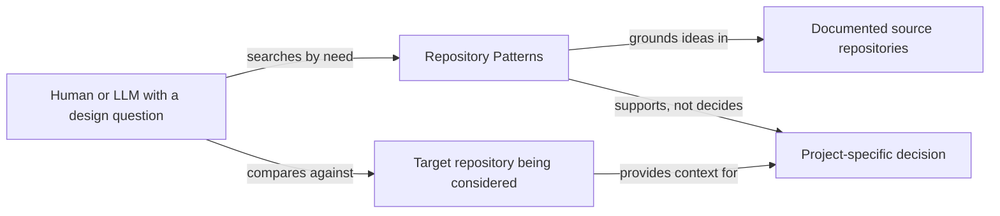
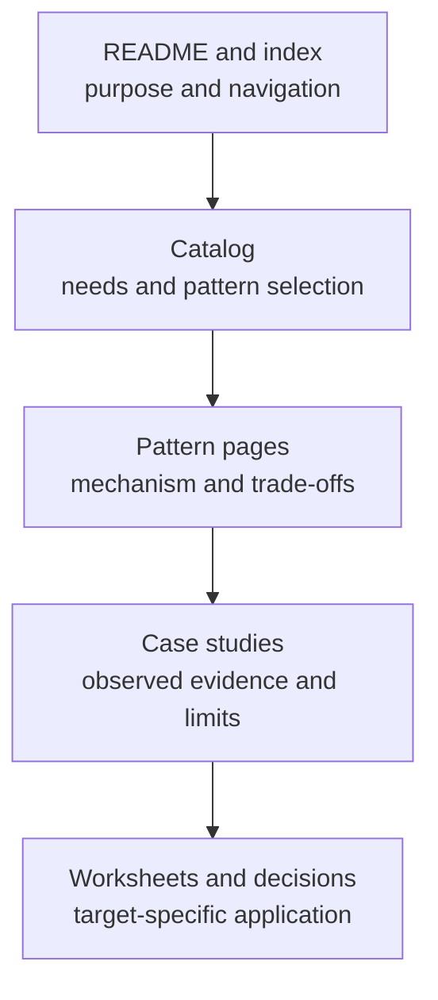
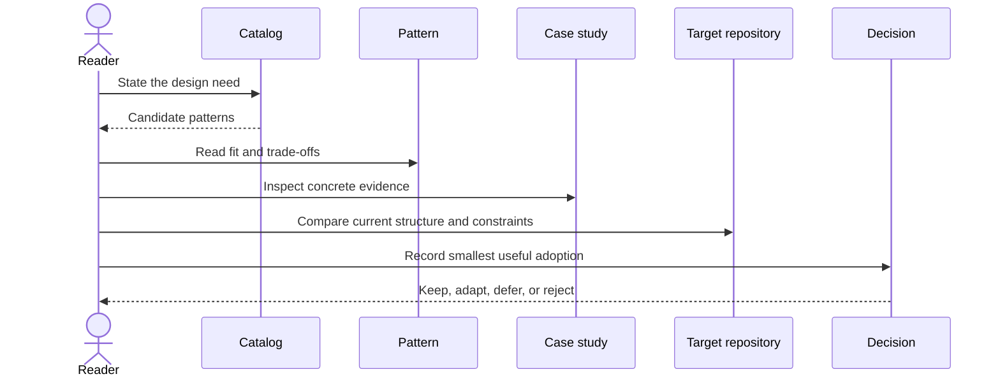

# Repository Patterns — architecture map

## Purpose

This repository helps a human or LLM move from a design question to a context-specific recommendation, supported by examples and explicit trade-offs.

## Level 1 — Context

**Purpose:** This section answers “Who uses this repository, and what does it provide?”

- The repository provides ideas, vocabulary, and examples.
- The target project remains the authority for its own design.
- Examples are evidence for a pattern, not instructions to reproduce the example.

## Sections in this model

| Section | Purpose |
|---|---|
| Catalog | Find a candidate by need rather than browsing every document. |
| Patterns | Understand the mechanism, fit, costs, and failure modes. |
| Case studies | See the pattern in a real repository and distinguish observation from interpretation. |
| Adoption worksheets | Translate an idea into a bounded target-repository decision. |
| Templates | Keep future additions consistent without turning them into compliance rules. |

## Level 2 — Information layers

**Purpose:** This section answers “What does each documentation layer own?”

| Layer | Owns | Does not own |
|---|---|---|
| Hook | Purpose and reading path | Full pattern prose |
| Catalog | Need-to-pattern routing | Project decisions |
| Pattern | General recommendation and trade-offs | Claim that adoption is correct |
| Case study | Source-backed example and limits | Universal guidance |
| Adoption | Target-specific reasoning | Reusable pattern definition |

## Key flow

**Purpose:** This section answers “How should a reader use one pattern?”

## Facts and inferences

- **Observed:** The repository separates catalog, patterns, case studies, templates, and adoption material.
- **Recommended:** A reader should inspect one pattern and one example before proposing adoption.
- **Inferred:** This structure should reduce cargo-cult copying because it puts fit and trade-offs beside the example.

## How to explore this map

Start with [`docs/catalog.md`](catalog.md), then choose one pattern. Ask for a focused dive into a pattern, a case study, or an adoption worksheet rather than loading the entire repository at once.
