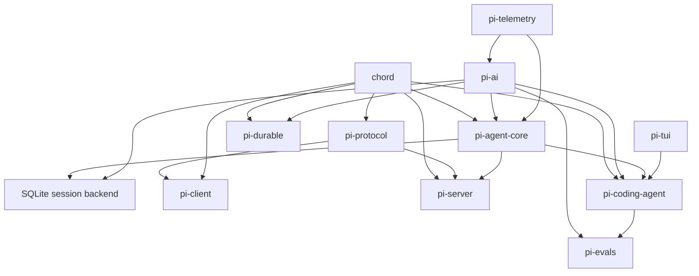

# Pi — layered architecture notes

## Purpose

This document gives a deeper architecture reading of Pi for readers who want to understand the example before applying one of its patterns.

## Dependency shape



The graph is layered but not a single straight line. Chord, remote transport, durable design, and evaluation are parallel capabilities.

## Layer observations

### Foundations

Chord, telemetry, and TUI are reusable concerns. They are kept outside the main agent package so they can evolve and be consumed independently.

### Provider boundary

`pi-ai` owns provider metadata, authentication, model catalogs, streaming, and provider-specific request translation. The rest of the system sees normalized contracts.

### Agent boundary

`pi-agent-core` owns the loop, messages, tool scheduling, event order, and lifecycle. It translates internal agent messages to LLM messages only at the provider boundary.

### Host boundary

`pi-coding-agent` composes the core with sessions, resources, tools, extensions, and presentation modes. This is where product-specific decisions live.

### Recovery boundary

The harness and session designs model durable state, operation admission, effect-pending work, and recovery. This is the most specialized part of the architecture and the least suitable for casual copying.

### Remote boundary

Protocol, client, and server packages handle framing, identity, routing, and attachment lifecycle while keeping application payload semantics opaque.

## Important distinction

Pi's README is explicit that the agent does not provide a built-in filesystem, process, network, or credential sandbox. Stronger isolation is externalized to a container, micro-VM, or policy-controlled sandbox. That is a trust-boundary decision, not an implementation omission.

## Architecture conclusion

The repository's strongest design move is aligning package boundaries with sources of change:

```text
provider change      -> pi-ai
agent-loop change    -> pi-agent-core
product/UI change    -> coding-agent or extensions
storage change       -> session backend
transport change     -> protocol/client/server
observability change -> telemetry
```

That alignment is more reusable than any individual folder name.
